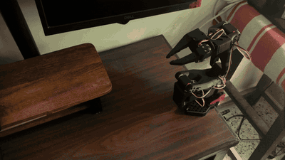
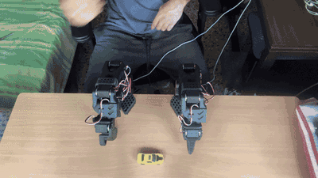

# BT-101

A voice-commanded physical AI robot built on the SO-101 platform - moving from teleoperation, through imitation learning, to autonomous manipulation, capped by a voice-responsive expressive assistant.

BT nods to BT-7274 (Titanfall 2): the tight-loop trust between a pilot and a machine acting as an extension of intent.

101 is double meaning: the SO-101 arm hardware, and an honest marker that this is a foundational, first-principles pass at the discipline.

This project is deliberately built **from scratch** where it matters: leader-follower and joystick teleop were first validated using LeRobot's own built-in examples, then reimplemented from the ground up (raw serial protocol, servo register maps, control loop) to build real understanding of the control loop rather than treating the library as a black box.

## Project Arc

- [x] **Phase 1 - Teleoperation**
  - [x] Joystick teleop (Xbox controller -> Feetech servos), from scratch
  - [x] Leader-follower teleop, from scratch 
- [ ] **Phase 2 - Imitation Learning** - record demonstrations, train ACT and Diffusion Policy models
- [ ] **Phase 3 - Autonomous Manipulation** - validate trained policies on real pick-and-place tasks
- [ ] **Phase 4 - Expressive Embodied Assistant** *(capstone)* - voice-responsive companion: listens via STT, generates expressive motion while talking

## Demo

**Joystick teleop:** Xbox controller driving the SO-101 follower arm in real time:



**Leader-Follower teleop**: The leader arm is used to teleoperate the follower arm in real time:



## Results

**Teleop loop rate:** measured with `measure_hz.py` ([joystick](teleop/joystick/analysis/measure_hz.py), [leader-follower](teleop/leader-follower/analysis/measure_hz.py)) over 30 s runs on a 1 Mbps servo bus.

| Teleop | Condition | Rate | Median cycle |
|---|---|---|---|
| Joystick | All joints held | 276 Hz | 3.60 ms |
| Joystick | All joints driven | 500 Hz | 2.00 ms |
| Joystick | Normal driving | 293 Hz | 3.41 ms |
| Leader-follower | Leader at rest | 144 Hz | 6.93 ms |
| Leader-follower | Normal teleop | 145 Hz | 6.90 ms |

Both loops are entirely bus-bound: ~99.5% of each cycle is serial round trips at ~0.3 ms each, so the rate is set by how many calls a cycle makes (joystick 6–12, leader-follower 24). The timing is very consistent (p99 within 15% of median). Full analysis: [docs/phase_logs/phase1_teleop_loop_rate.md](docs/phase_logs/phase1_teleop_loop_rate.md)

## Hardware

- **Manipulator:** SO-101 leader-follower arm pair: open-source design by [TheRobotStudio](https://github.com/TheRobotStudio/SO-ARM100), in collaboration with Hugging Face.
- **Servos:** Feetech STS3215 serial bus servos, driven over USB (CDC-ACM serial) via two Feetech/Waveshare driver boards.

## Repository Structure

```
BT-101/
├── teleop/
│   ├── joystick/          - Xbox controller → servo teleop (from scratch, hardware-validated)
│   └── leader-follower/   - leader-follower teleop (from scratch, hardware-validated)
└── docs/
    ├── media/             - demo gifs, plots, and photos of the physical rig
    └── phase_logs/        - per-milestone write-ups and result analysis
```


## Acknowledgments

- [TheRobotStudio](https://github.com/TheRobotStudio/SO-ARM100) - SO-101 / SO-ARM100 hardware design (Apache 2.0)
- [Hugging Face LeRobot](https://github.com/huggingface/lerobot) - robot learning framework (Apache 2.0), used to validate hardware before from-scratch reimplementation
- 3D-printed parts sourced from TheRobotStudio's SO-ARM100 repo and/or community remixes - check individual file licenses (some are CC-BY-SA and require attribution)

## License

MIT — see [LICENSE](LICENSE).
