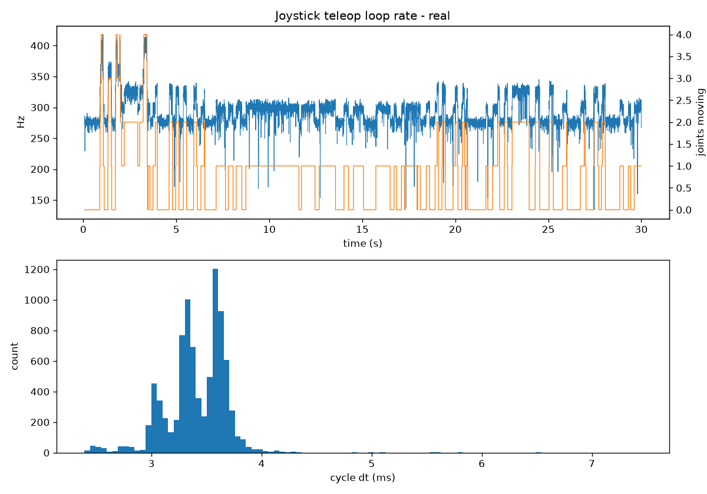
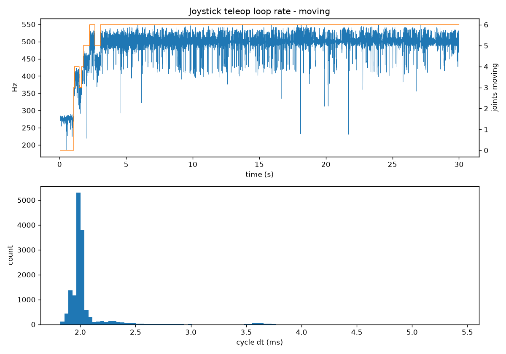
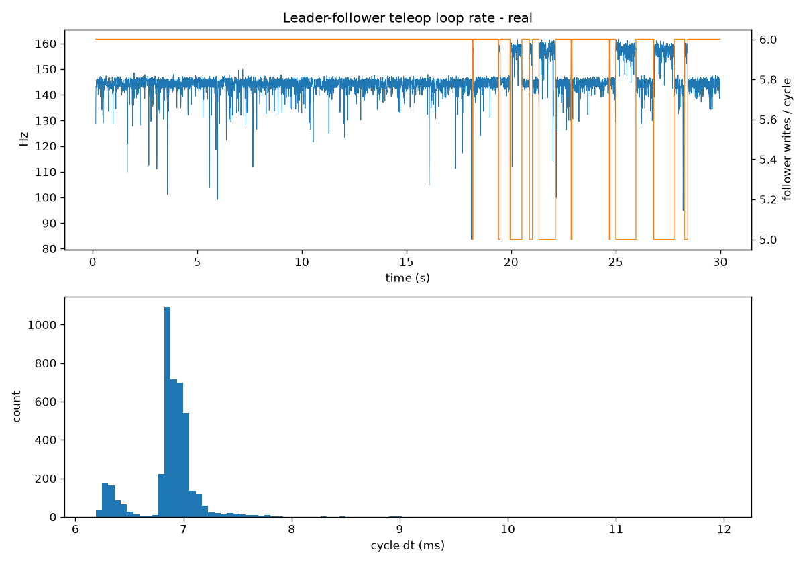

# Phase 1 — Teleop Loop Rate Analysis

How fast do the two from-scratch teleop loops (joystick and leader-follower) actually run, what limits them, and what does that mean for Phase 2 data recording?

## Joystick teleop

### Goal

Measure the command rate of the joystick teleop loop (`teleop/joystick/controller.py`) and find out where the time in each cycle goes. The rate itself matters less than knowing the headroom: Phase 2 demonstration recording needs a fixed-rate loop (ACT/ALOHA used 50 Hz), so the teleop loop has to comfortably beat that.

### Method

`teleop/joystick/analysis/measure_hz.py` runs the same input translation and `servo.move()` calls as `controller.py`, and per cycle records:

- a `time.perf_counter()` timestamp at the top of the cycle (monotonic, unlike `time.time()`),
- time spent reading the controller (`pg.event.pump()` + axis/button reads),
- time spent in the six `servo.move()` calls (the serial bus),
- how many joints were being driven vs. held.

Data goes into pre-allocated numpy arrays and is only saved after the loop exits — no printing or file I/O inside the loop, so measuring doesn't slow down what's being measured. The first 20 cycles are dropped as warm-up.

**Why joint state matters:** `WritePosEx` is a full round trip (`writeTxRx` — it waits for the servo's status reply). In `move()`, a driven joint costs 1 round trip (write only), while a held joint costs 2 (read present position, write it back). So one cycle costs between 6 and 12 bus transactions depending on the sticks, and "the Hz" is not a single number.

Three 30 s runs, 1 Mbps bus, follower arm on `/dev/ttyACM0`:

| Run | Condition |
|---|---|
| idle | hands off — all 6 joints held (12 round trips/cycle) |
| moving | both sticks in a corner + LB + RT held — all 6 driven (6 round trips/cycle) |
| real | normal driving |

### Results

| Run | Cycles | Mean rate | Median dt | p99 dt | Max dt |
|---|---|---|---|---|---|
| idle | 8249 | **276 Hz** | 3.60 ms | 4.21 ms | 9.09 ms |
| moving (6 driven) | 13675 | **500 Hz** | 2.00 ms | 2.37 ms | 4.34 ms |
| real | 8770 | **293 Hz** | 3.41 ms | 3.99 ms | 7.45 ms |

Loop rate by number of joints being driven (medians taken from the moving and real runs):

| Joints driven | Round trips | Median dt | Rate |
|---|---|---|---|
| 0 | 12 | 3.61 ms | 275 Hz |
| 1 | 11 | 3.34 ms | 297 Hz |
| 2 | 10 | 3.05 ms | 324 Hz |
| 3 | 9 | 2.78 ms | 356 Hz |
| 4 | 8 | 2.51 ms | 396 Hz |
| 5 | 7 | 2.27 ms | 438 Hz |
| 6 | 6 | 2.00 ms | 500 Hz |

Where the time goes (real run, per cycle): controller input **0.014 ms**, servo bus **3.40 ms**, other overhead **0.002 ms**. Zero cycles exceeded 3× the median dt across ~31k cycles.



*Normal driving. Top: loop rate (blue) steps up as more joints are driven (orange). Bottom: the dt histogram has one peak per joint-count — each driven joint removes one round trip.*



### Analysis

**The loop is entirely bus-bound.** Controller input and Python overhead are ~0.5% of the cycle. Optimizing anything other than the serial traffic would gain nothing.

**Cycle time is linear in round trips.** Each additional driven joint removes one read and cuts ~0.27 ms. Solving from the two extreme runs:

- all driven: 6 writes = 2.00 ms → **write ≈ 0.33 ms**
- all held: 6 writes + 6 reads = 3.62 ms → **read ≈ 0.27 ms**

That's why idle is 1.8× slower than all-driven rather than 2×: reads are cheaper than writes.

**Wire time vs. fixed overhead.** At 1 Mbps (8N1, 10 bits/byte) each byte takes 10 µs:

| Transaction | Bytes (request + reply) | Wire time | Measured | Fixed overhead |
|---|---|---|---|---|
| `WritePosEx` | 14 + 6 | 0.20 ms | 0.33 ms | ~0.13 ms |
| `read2ByteTxRx` | 8 + 8 | 0.16 ms | 0.27 ms | ~0.11 ms |

So roughly 60% of each round trip is bytes on the wire and ~0.12 ms is a fixed per-transaction cost (USB transfer scheduling, OS serial driver, servo response time). The overhead being about the same for both transaction types is a good consistency check on the model.

**Timing is very consistent.** p99 is within ~15% of the median and the worst cycle in 30 s was 9 ms. Plain Python on stock Ubuntu is not a jitter problem at this scale.

### What the number does *not* mean

~300 Hz is the rate at which *commands are sent*, not the arm's control bandwidth. Position control runs inside each STS3215, and the motion profile is set by the `speed=1000, acc=50` passed to `WritePosEx`. Most of those writes re-send an unchanged goal. Similarly, when a stick is released the hold command lands within ~4 ms — any overshoot comes from the servo's deceleration profile, not the loop.

### What I'd change

- **Sync write.** One `SYNC_WRITE` packet for all six servos is ~56 bytes with no status replies — roughly 0.7 ms estimated, vs. 2.0 ms for six individual writes. This is why LeRobot uses sync read/write.
- **Don't re-command held joints every cycle.** Only send a hold when a joint transitions from driven to released; that removes the read + write pair per held joint entirely.
- **Fixed-rate loop for recording.** The free-running period varies from 2.0 to 3.6 ms with stick input. A dataset recorder needs a constant period (sleep to fill the remainder), e.g. 30–50 Hz — there's plenty of headroom for that.

<!-- TODO (Pranav): "What surprised me" — write this section in your own words. -->

### Reproduce

```
cd teleop/joystick/analysis
python measure_hz.py --label idle --duration 30
python measure_hz.py --label moving --duration 30
python measure_hz.py --label real --duration 30
```

Prints the stats above and saves `results/hz_<label>.npz` (raw timings) and `results/hz_<label>.png` (plots; gitignored — curated copies live in `docs/media/joystick/`).

## Leader-follower teleop

### Prediction

Before measuring, from the joystick cost model: per joint, `read()` does a follower read + leader read, then `move()` does another follower read + a write. 6 joints × (3 × 0.27 + 0.33) ≈ 6.8 ms → **~145 Hz**.

### Method

`teleop/leader-follower/analysis/measure_hz.py` runs the same loop as `teleop.py` without modifying `servo_control.py`. Instead, it wraps the three bus calls on the SDK objects (leader `read2ByteTxRx`, follower `read2ByteTxRx`, follower `WritePosEx`) with timers, so every cycle records the count and time of each call type, plus comm failures. Same measurement hygiene as the joystick script: `perf_counter`, pre-allocated arrays, no I/O in the loop, 20 warm-up cycles dropped.

Two 30 s runs, 1 Mbps on both buses (leader `/dev/ttyACM1`, follower `/dev/ttyACM0`):

| Run | Condition |
|---|---|
| still | leader resting, untouched |
| real | normal teleoperation, gripper included |

### Results

| Run | Cycles | Mean rate | Median dt | p99 dt | Max dt |
|---|---|---|---|---|---|
| still | 4283 | **144 Hz** | 6.93 ms | 7.68 ms | 10.72 ms |
| real | 4335 | **145 Hz** | 6.90 ms | 7.75 ms | 11.96 ms |

Prediction: 6.8 ms. Measured: 6.9 ms — within ~2%.

Per-call cost (real run):

| Call | Calls/cycle | Mean per call | Share of cycle |
|---|---|---|---|
| leader read | 6.00 | 0.277 ms | 24.1% |
| follower read | 11.86 | 0.275 ms | 47.4% |
| follower write | 5.86 | 0.331 ms | 28.2% |
| other (Python, mapping math) | — | 0.020 ms/cycle | 0.3% |

Zero comm failures and zero cycles above 3× the median dt in either run.



*Normal teleop. The rate sits at ~145 Hz and jumps to ~157 Hz whenever a cycle does 5 follower writes instead of 6 (orange); the histogram's small left peak at ~6.3 ms is those cycles.*

### Analysis

**The cost model carries over to a second board and port.** Leader reads on a separate driver board cost the same as follower reads (0.277 vs 0.275 ms), and all three costs match the joystick measurements (0.27 read / 0.33 write). Loop time is simply number of calls × cost per call.

**The rate does not depend on motion — unlike joystick.** The joystick skips its read-back for driven joints, so its rate varies with stick input. Here, `read()` only skips a joint when `follower_goal != f_pos` is False. `follower_goal` is a float from the linear mapping and `f_pos` is an integer tick, so they are almost never equal: every joint is read twice and written every cycle, whether or not the leader moved.

**The 5-write cycles were not out-of-range skips.** An out-of-range goal skips only the write — `move()`'s follower read still happens. But follower reads dropped by the same amount as writes (0.14/cycle, matching 591/4335 cycles), and those cycles were 0.60 ms faster ≈ one read + one write (0.275 + 0.33). So `read()` returned False: the float and the integer *did* compare equal for one joint.

Hypothesis (not yet verified): it's **wrist_roll**. Its leader and follower ranges are both 0–4095, so the mapping is the identity and `follower_goal` is an exact integer — equal to `f_pos` whenever the follower lands exactly on target. For every other joint the mapped value is almost never a whole number. Verifying this needs per-joint logging of skipped IDs.

**Follower reads are 47% of the cycle, and mostly redundant.**

- The read in `move()` fetches `position` and never uses it — it only acts as a comm check. 6 × 0.275 ≈ 1.65 ms/cycle.
- The read in `read()` only feeds the `!=` check, which almost never skips anything.

**The leader's separate port is unused parallelism.** Leader reads (24% of the cycle) run in series with follower traffic even though they're on a different bus.

**Joints are sampled sequentially, not as a snapshot.** Within one cycle, joint 6's leader position is read ~5.8 ms after joint 1's. For teleop at 145 Hz this doesn't matter. For Phase 2 dataset recording it does: the recorded "state" at one timestep isn't a simultaneous snapshot of the arm.

### What I'd change

Estimated from the measured per-call costs (not yet measured):

| Change | Calls/cycle | ≈ Cycle time | ≈ Rate |
|---|---|---|---|
| Current | 24 | 6.9 ms | 145 Hz |
| Drop `move()`'s unused follower read | 18 | 5.3 ms | 190 Hz |
| Also drop `read()`'s follower read | 12 | 3.6 ms | 275 Hz |
| Sync read leader + sync write follower | 2 | ~1 ms | ~1 kHz range |

Sync read also fixes the snapshot problem: all six leader positions come from one transaction.

<!-- TODO (Pranav): "What surprised me" — write this section in your own words. -->

### Reproduce

```
cd teleop/leader-follower/analysis
ls -l /dev/serial/by-id/          # confirm which port is leader vs follower
python measure_hz.py --label still --duration 30
python measure_hz.py --label real --duration 30
```

Pass `--leader-port` / `--follower-port` if the ports are swapped. Output goes to `results/hz_<label>.npz` / `.png` (gitignored — curated copies live in `docs/media/leader-follower/`).

## Joystick vs. leader-follower

| | Joystick | Leader-follower |
|---|---|---|
| Bus calls per cycle | 6–12 (depends on input) | 24 (constant) |
| Normal-use rate | 293 Hz | 145 Hz |
| Rate depends on motion | yes | no |
| Bus share of cycle | ~99.5% | ~99.7% |

Both loops are fully bus-bound, run with very little jitter, and have large headroom over a 30–50 Hz Phase 2 recording rate. The shared fix for both is fewer, larger transactions (sync read/write).
